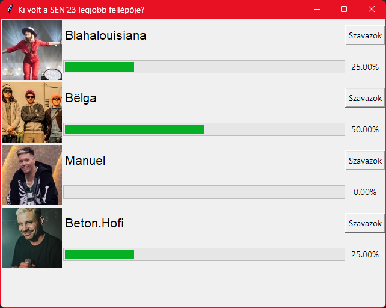

## Programozás 2 - 2. ZH feladat

A `server` mappában adott egy szavazatszámláló Flask szerver.
A szavazás tárgya és a szavazati lehetőségek az itt található `votes.json` fájlban vannak tárolva, a beérkezett darabszámokkal együtt.
Ezeket a `/results` végponttól lehet lekérdezni, ami egy ugyanilyen felépítésű JSON-t ad vissza.

A szerver csak tesztelés céljából került megadásra, a feladat egy grafikus szavazó kliensprogram elkészítése Tkinterrel.
A szerver címét a `settings.json`-ben található `server_url` értékéből olvassa be a program!

Az aktuális szavazás adatait a szervertől kell lekérdezni.
A kérdés jelenjen meg az ablak fejlécében, a szavazati lehetőségek pedig egymás alatt az ablakban.

A szavazati lehetőségek (opciók) megjelenítéséért egy saját osztály feleljen, ami felépíti és tárolja a GUI elemeket minden opcióhoz:
- Az opcióhoz tartozó kép, amely a `/static/img/<id>.jpg` végpontról tölthető le.
- Az opció neve (`"name"`).
- Egy "Szavazok" gomb.
- A jelenlegi szavazati arányt mutató `tkinter.ttk.Progressbar`. A megoldáshoz elegendő a `value` beállítását változtatni 0-100 között a százalékos aránynak megfelelően.
- A szavazatok százalékát tartalmazó felirat.

A szavazatokat egy párhuzamos szál 1 másodpercenként kérje le és frissítse a felületet.

A szavazó gomb küldje el a kiválasztott opció id-ját a `/vote` végpontra egy ilyen formátumú JSON üzenetben: `{"candidate_id": 1}`.
Ezután tiltsa le a szavazógombokat és állítsa át a `settings.json`-ben a `voted_on` értékét az aktuális kérdésre.
A program indulásakor is legyenek letiltva a gombok, ha ennek az értéke megegyezik az aktuális kérdéssel.

A felület kinézete kövesse az alábbi képernyőképen látható elrendezést:

